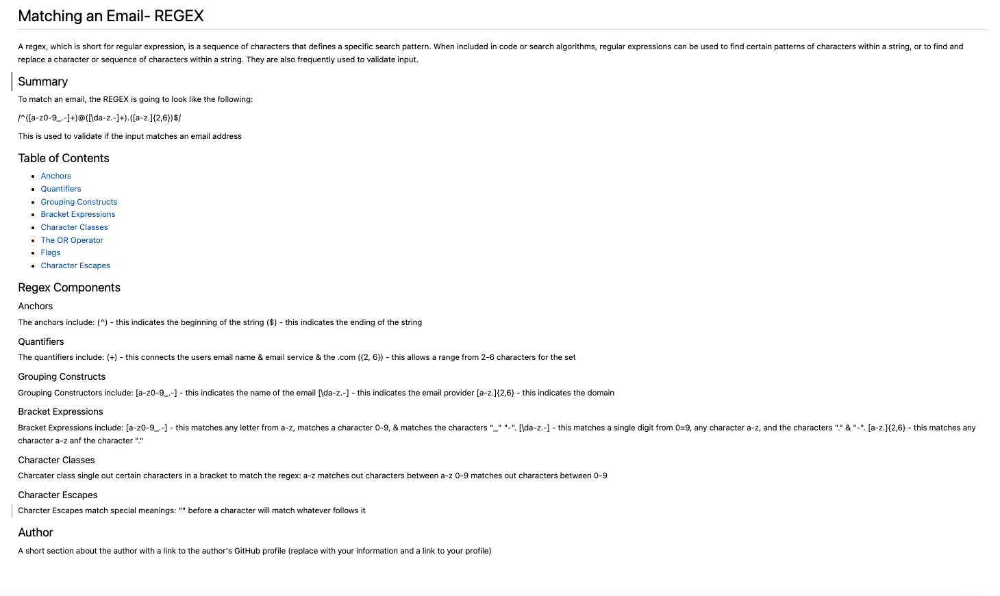

# Computer-Science-for-JavaScript-Regex-Tutorial
Your assignment this week is to create a tutorial that explains how a specific regular expression, or regex, functions by breaking down each part of the expression and describing what it does. You'll use the template provided in the starter code to create your walkthrough

## Screenshot

## Github link
[Live-link](https://christilato.github.io/Challenge2/)